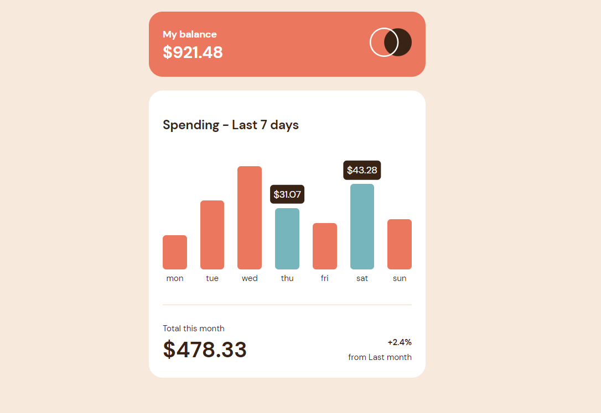

# Frontend Mentor - Expenses chart component solution

This is a solution to
the [Expenses chart component challenge on Frontend Mentor](https://www.frontendmentor.io/challenges/expenses-chart-component-e7yJBUdjwt).
Frontend Mentor challenges help you improve your coding skills by building realistic projects.

## Table of contents

- [Overview](#overview)
    - [The challenge](#the-challenge)
    - [Screenshot](#screenshot)
    - [Links](#links)
- [Author](#author)

## Overview

### The challenge

Users should be able to:

- View the bar chart and hover over the individual bars to see the correct amounts for each day
- See the current day’s bar highlighted in a different colour to the other bars
- View the optimal layout for the content depending on their device’s screen size
- See hover states for all interactive elements on the page
- **Bonus**: Use the JSON data file provided to dynamically size the bars on the chart

### Screenshot

### Links

- Live Site URL: [Live site](https://mister-mandarin.github.io/expenses-chart-component-main)

## Author

- GitHub - [@mister-Mandarin](https://github.com/mister-Mandarin)
- Frontend Mentor - [@mister-Mandarin](https://www.frontendmentor.io/profile/mister-Mandarin)
- VK - [@Andrey](https://vk.com/andrei_poluektov)
- Instagram - [@Mandarin](https://www.instagram.com/andrey_poluehktov/)